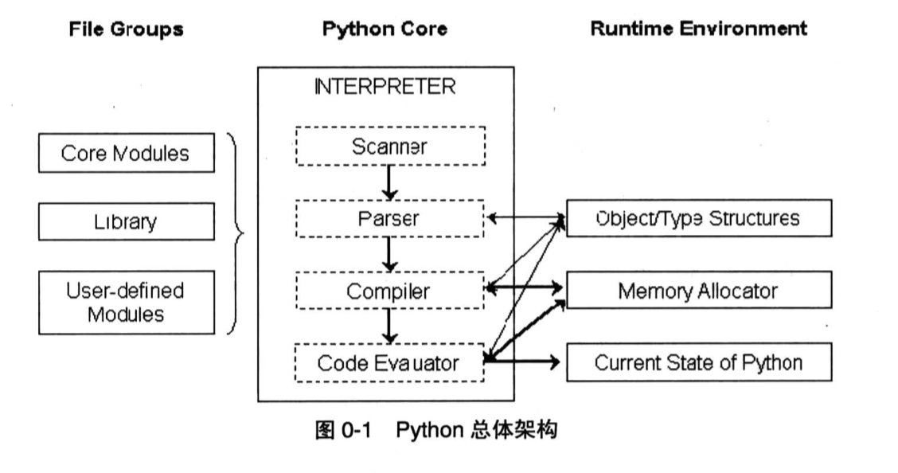
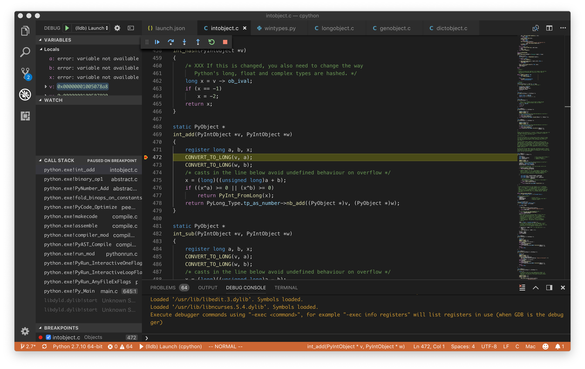
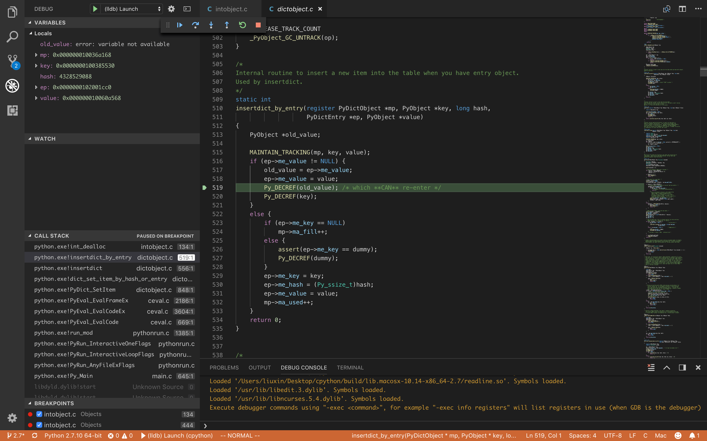
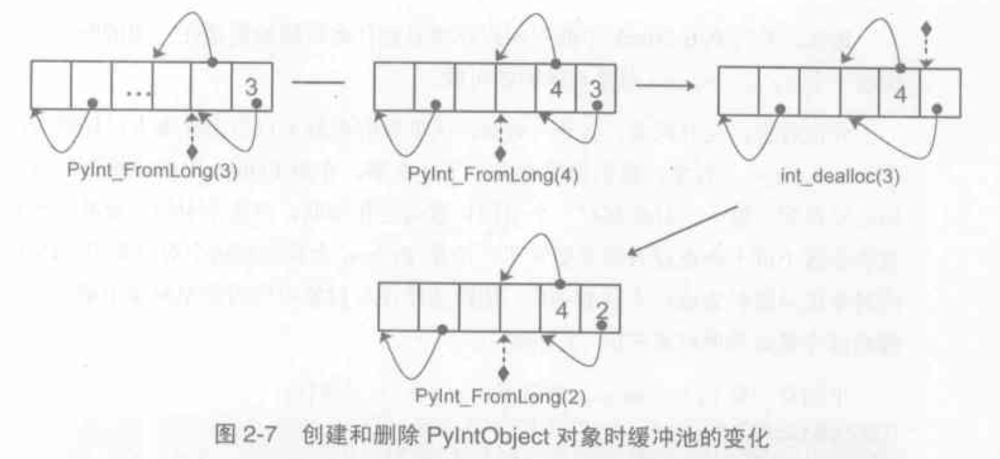
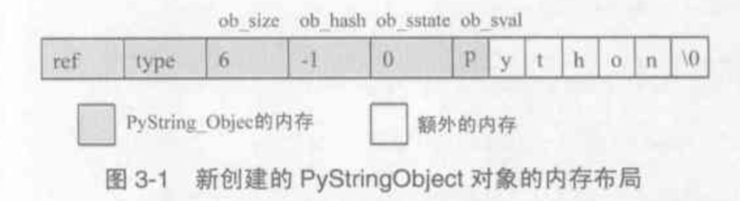
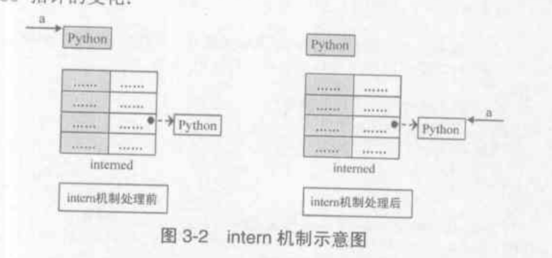
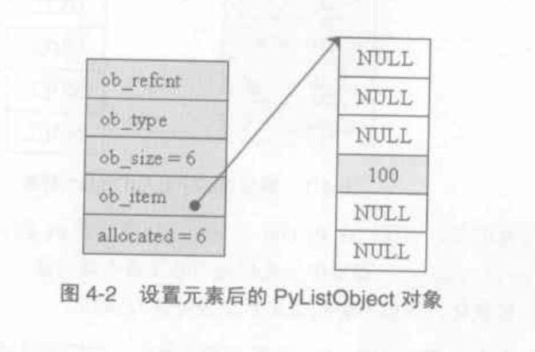
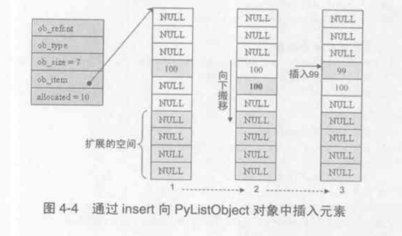
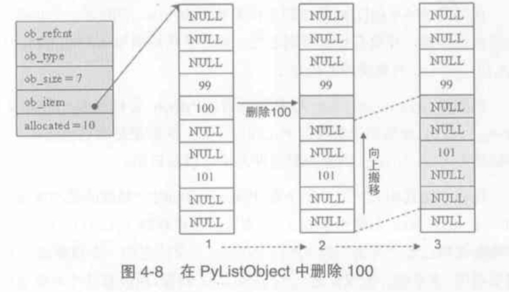
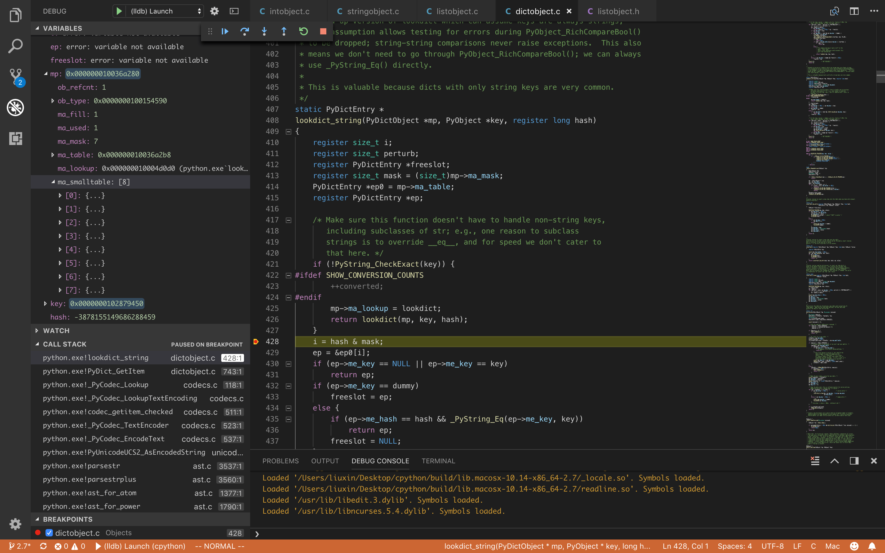

Python源码学习笔记
=================

参考《Python源码剖析》，主要内容有：

1. 对象系统和内存管理
    - PyObject,int,str,list,dict,class
1. 虚拟机与AST
    - interpreter->thread->frame->code->namespace->closure...
1. 其他
    - 垃圾回收、GIL、import
    

## Python总体架构



### Python源码结构

- Include  	Python提供的所有头文件（著名的Python.h)
- Lib		Python自带的标准库，python写的
- Modules    	标准库，c写的
- Parser		语法分析部分
- Objects 	所有的内建对象c实现
- Python		Compiler和Runtime引擎部分，运行核心所在
- Mac/PCBuild...  平台编译部分


### 学习环境
*   采用python2.7最新github代码
*   macbook 开发环境 gcc编译
*   vscode + lldb做debugger

### 编译python
参考源码/Mac/README，用gcc编译python
```
./configure
make
```


在用vscode+lldb调试启动编译出来的`./python.exe`
attach断不下来，不知道为何，直接用lldb可以attach。
为了方便看源码，所以用vscode+lldb调试启动，
然后可以通过断点的方式很方便地查看调用栈，配合《源码剖析》看非常有帮助。

如下图，可以看出一个简单的 1+2 c栈真tm深啊



vscode配置如下：
```
    "configurations": [
        {
            "name": "(lldb) Launch",
            "type": "cppdbg",
            "request": "launch",
            "program": "${workspaceFolder}/python.exe",
            "args": [],
            "stopAtEntry": false,
            "cwd": "${workspaceFolder}",
            "environment": [],
            "externalConsole": true,
            "MIMode": "lldb"
        }
    ]
```

## PyIntObject
在python中`all is object`，所以PyObject是整个python对象系统的基石，来看看PyObject的实现

### PyObject
```
[intobject.h]
typedef struct {
    PyObject_HEAD
    long ob_ival;
} PyIntObject;

[object.h]
/* PyObject_HEAD defines the initial segment of every PyObject. */
#define PyObject_HEAD                   \
    _PyObject_HEAD_EXTRA                \
    Py_ssize_t ob_refcnt;               \
    struct _typeobject *ob_type;
```

其中`_PyObject_HEAD_EXTRA`用来trace refs，在release版中为空，所以

*   PyObject = ob_refcnt（引用计数）+ *ob_type（类型指针）
*   PyIntObject = PyObject + ob_ival （整数值）

这里也能看出refcnt对于python是多么重要，垃圾回收贯穿全场


```
[object.h]
typedef struct _object {
    PyObject_HEAD
} PyObject;

typedef struct {
    PyObject_VAR_HEAD
} PyVarObject;
```

*   PyVarObject（变长对象）= PyObject + ob_size（长度），更多可参考object.h


### PyTypeObject


int(10)  -is instance of-> int -is subclass of-> object -is instance of-> type

TODO：ob_type.tp_base 与 mro的关系，新式class


### 多态的实现
同一个函数根据调用对象类型，表现不同的行为

```
void PyObject_Print(PyObject *object){
object->ob_type->tp_print(object);
}

PyTypeObject PyInt_Type = {
    PyVarObject_HEAD_INIT(&PyType_Type, 0)
    "int",
    sizeof(PyIntObject),
    0,
    (destructor)int_dealloc,              /* tp_dealloc */
    (printfunc)int_print,                     /* tp_print */
    0,                                          		/* tp_getattr */
    0,                                        		 /* tp_setattr */
    (cmpfunc)int_compare,                /* tp_compare */
    ....
}
```
这里的PyType_Type，包含了不同行为的指针，这些指针使得不同类型可以有一些共用的方法
共有的比如有print  hash doc ，可选的tp_getattr tp_setattr tp_as_sequence tp_as_mapping

tp_as_int 指向 int_as_number 则定义了一列方法，用于处理number


### 引用计数

```
#define Py_INCREF(op) (                         \
    _Py_INC_REFTOTAL  _Py_REF_DEBUG_COMMA       \
    ((PyObject*)(op))->ob_refcnt++)

#define Py_DECREF(op)                                   \
    do {                                                \
        if (_Py_DEC_REFTOTAL  _Py_REF_DEBUG_COMMA       \
        --((PyObject*)(op))->ob_refcnt != 0)            \
            _Py_CHECK_REFCNT(op)                        \
        else                                            \
        _Py_Dealloc((PyObject *)(op));                  \
    } while (0)

#define _Py_Dealloc(op) (                               \
    _Py_INC_TPFREES(op) _Py_COUNT_ALLOCS_COMMA          \
    (*Py_TYPE(op)->tp_dealloc)((PyObject *)(op)))
#endif /* !Py_TRACE_REFS */
```

引用到对象时，调用Py_INCREF，增加引用计数。
解除引用时，调用Py_DECREF，减为0则析构op_type->tp_dealloc。

析构不一定是free，更多可能是归还到内存对象池。
Python中大量采用内存对象池（不同于内存池）技术，避免频繁地申请释放内存。
空间换时间，提高效率。

实例，当a = 4444 时，其实是在locals() 的dict里面set_item。
然后减小了3333的引用，最终触发3333的dealloc。
```
>>> a = 3333
>>> a = 4444
```

```
static void
int_dealloc(PyIntObject *v)
{
    if (PyInt_CheckExact(v)) {
        Py_TYPE(v) = (struct _typeobject *)free_list;
        free_list = v;
    }
    else
        Py_TYPE(v)->tp_free((PyObject *)v);
}
```

要么归还到free_list，要么free掉。
其实是int就归还，继承int的class就free。

#### free_list
一个free intobject 内存池的链表头，指向下一个空闲的intobject内存。
在dealloc的时候，将待回收的intobject插入链表头，然后用object->ob_type指针链起来（这里都是int了，所以ob_type没有用了，拿来做链表）。

#### block_list
那么intobject的内存池到底是怎样组织的呢？答案就是block_list，其实很多对象内存池都是这样。
初始化intobject的时候，如果没有free_list，就申请一个新的block，加入block_list链表。


初始化block_list调用fill_free_list，将空位用ob_type指针一个个链起来，然后用free_list指向链表头，然后用这个free_list链表在创建和删除intobject时来维护空位。


如上图，要注意的是free_list是可以跨block的。

另外有个可怕的事情，blocklist只有申请没有释放，所以最大池子=同一时间最多intobject的数量。


### 小整数对象
```
int
_PyInt_Init(void)
{
    PyIntObject *v;
    int ival;
#if NSMALLNEGINTS + NSMALLPOSINTS > 0
    for (ival = -NSMALLNEGINTS; ival < NSMALLPOSINTS; ival++) {
        if (!free_list && (free_list = fill_free_list()) == NULL)
            return 0;
        /* PyObject_New is inlined */
        v = free_list;
        free_list = (PyIntObject *)Py_TYPE(v);
        (void)PyObject_INIT(v, &PyInt_Type);
        v->ob_ival = ival;
        small_ints[ival + NSMALLNEGINTS] = v;
    }
#endif
    return 1;
}
```
在python启动的时候，会创建一系列的小整数，默认[-5,257)，跟随整个python进程的生命周期。
如上代码，创建时PYObject_INIT即会将refcount=1，而不是赋值时，所以refcount永远>0，永远不会走到dealloc，也不会归还给free_list。

所以初始化intobject时，在small_ints的直接取对象，否则创建新的intobject。
```
PyObject *
PyInt_FromLong(long ival)
{
    register PyIntObject *v;
#if NSMALLNEGINTS + NSMALLPOSINTS > 0
    if (-NSMALLNEGINTS <= ival && ival < NSMALLPOSINTS) {
        v = small_ints[ival + NSMALLNEGINTS];
        Py_INCREF(v);
        return (PyObject *) v;
    }
#endif
    if (free_list == NULL) {
        if ((free_list = fill_free_list()) == NULL)
            return NULL;
    }
    /* Inline PyObject_New */
    v = free_list;
    free_list = (PyIntObject *)Py_TYPE(v);
    (void)PyObject_INIT(v, &PyInt_Type);
    v->ob_ival = ival;
    return (PyObject *) v;
}
```
这也导致所有小整数都是指向同一个对象，而大整数不是
```
>>> a = 256 
>>> b = 256
>>> a is b
True
>>> a = 257
>>> b = 257
>>> a is b
False
```

### 断点看看

在int_print里面打个断点，用watch看看free_list和block_list的分布吧


到这里，最简单的int对象就讲完了，顺带有一些内存管理通用的分析，下面看看略复杂一点的string对象

## PyStringObject

```
typedef struct {
    PyObject_VAR_HEAD
    long ob_shash;
    int ob_sstate;
    char ob_sval[1];

    /* Invariants:
     *     ob_sval contains space for 'ob_size+1' elements.
     *     ob_sval[ob_size] == 0.
     *     ob_shash is the hash of the string or -1 if not computed yet.
     *     ob_sstate != 0 iff the string object is in stringobject.c's
     *       'interned' dictionary; in this case the two references
     *       from 'interned' to this object are *not counted* in ob_refcnt.
     */
} PyStringObject;
```


首先是一个VAR_HEAD，多一个ob_size表示长度
注释写的很清楚：

*   ob_shash   缓存的hash值
*   ob_sstate  重要的intern机制，用于缓存
*   ob_sval[1]  指针，存放ob_size这么大的str，最后多一位'\0'表字符串结尾

所以实际这块的大小是ob_sval[ob_size+1]


### 不可变对象

> 注意：这里区分一下定长/变长(var_head)与可变/不可变(mutable/immutable)

PyStringObject是一个变长但是不可变对象。
也就是'a' + 'b' 生成 'ab'，其实生成了3个string对象
所以大量的str相加效率很低，每步都生成新str对象，最好用‘’.join只生成一次


### Intern机制
因为PyStringObject是不可变对象，所以我们只要是相同的字符串，可以永远指向同一对象
```
>>> a = "abc"
>>> b = "abc"
>>> a is b
True
```
```
PyObject *
PyString_InternFromString(const char *cp)
{
    PyObject *s = PyString_FromString(cp);
    if (s == NULL)
        return NULL;
    PyString_InternInPlace(&s);
    return s;
}
```
当我们生成一个str对象时，先生成一个真的新对象，然后去做inplace的intern。
这里是保存了一个interned的字典（对，就是python中的dict对象）。
如果发现在interned中，就把新对象指向原来的对象，立即销毁新对象，这也就是inplace。




### character缓存池
```
static PyStringObject *characters[UCHAR_MAX + 1];
static PyStringObject *nullstring;
```
类似于小整数，空字符或者单字符，都会缓存起来。
不同的是不在python init的时候创建，而在创建size为0或1的字符时。
```
PyObject *
PyString_FromString(const char *str)
{    ...
    /* share short strings */
    if (size == 0) {
        PyObject *t = (PyObject *)op;
        PyString_InternInPlace(&t);
        op = (PyStringObject *)t;
        nullstring = op;
        Py_INCREF(op);
    } else if (size == 1) {
        PyObject *t = (PyObject *)op;
        PyString_InternInPlace(&t);
        op = (PyStringObject *)t;
        characters[*str & UCHAR_MAX] = op;
        Py_INCREF(op);
    }
    return (PyObject *) op;
}
```


下次取单字符就直接从characters里面取了
```
    if (size == 1 && (op = characters[*str & UCHAR_MAX]) != NULL) {
        Py_INCREF(op);
        return (PyObject *)op;
    }
```


## PyListObject
我们的第一个容器对象
```
[listobject.h]
typedef struct {
    PyObject_VAR_HEAD
    /* Vector of pointers to list elements.  list[0] is ob_item[0], etc. */
    PyObject **ob_item;
    Py_ssize_t allocated;
} PyListObject;
```

*   **ob_item 指向了 PyObject* 的数组
*   allacated 记录分配了多少内存，ob_size是真正使用了多少，分别对应c++ vector中的capacity/size

```
     *     0 <= ob_size <= allocated
     *     len(list) == ob_size
     *     ob_item == NULL implies ob_size == allocated == 0
```

### insert
```
>>> l = [None] * 100
>>> l[3] = 100
```


```
static int
ins1(PyListObject *self, Py_ssize_t where, PyObject *v)
{
    Py_ssize_t i, n = Py_SIZE(self);
    PyObject **items;
    ...

    if (list_resize(self, n+1) == -1)
        return -1;

    if (where < 0) {
        where += n;
        if (where < 0)
            where = 0;
    }
    if (where > n)
        where = n;
    items = self->ob_item;
    for (i = n; --i >= where; )
        items[i+1] = items[i];
    Py_INCREF(v);
    items[where] = v;
    return 0;
}
```
因为要改变list的size了，所以重点是list_resize

### resize
```
static int
list_resize(PyListObject *self, Py_ssize_t newsize)
{
    PyObject **items;
    size_t new_allocated;
    Py_ssize_t allocated = self->allocated;

    //  不需要重新申请内存
    if (allocated >= newsize && newsize >= (allocated >> 1)) {
        assert(self->ob_item != NULL || newsize == 0);
        Py_SIZE(self) = newsize;
        return 0;
    }
    // 申请一定冗余的内存
    new_allocated = (newsize >> 3) + (newsize < 9 ? 3 : 6);
    new_allocated += newsize;
    ...
    // realloc & resize
    items = self->ob_item;
    if (new_allocated <= (PY_SIZE_MAX / sizeof(PyObject *)))
        PyMem_RESIZE(items, PyObject *, new_allocated);
    ...
    self->ob_item = items;
    Py_SIZE(self) = newsize;
    self->allocated = new_allocated;
    return 0;
}
```
resize策略：

1. 当 (allocated / 2 ) <= newsize <= allocated ，内存不变
2. 否则按newsize的比例，冗余一定的内存



append和remove时流程类似

删除的时候也会调用list_resize重新计算内存，调用memmove搬移内存



### 缓存池
```
#define PyList_MAXFREELIST 80
static PyListObject *free_list[PyList_MAXFREELIST];
static int numfree = 0;

static void
list_dealloc(PyListObject *op)
{
    Py_ssize_t i;
    PyObject_GC_UnTrack(op);
    Py_TRASHCAN_SAFE_BEGIN(op)
    if (op->ob_item != NULL) {
        // Do it backwards, for Christian Tismer.
        i = Py_SIZE(op);
        while (--i >= 0) {
            Py_XDECREF(op->ob_item[i]);
        }
        PyMem_FREE(op->ob_item);
    }
    if (numfree < PyList_MAXFREELIST && PyList_CheckExact(op))
        free_list[numfree++] = op;
    else
        Py_TYPE(op)->tp_free((PyObject *)op);
    Py_TRASHCAN_SAFE_END(op)
}
```
同样是缓存池，这里的有点意思，是在释放的时候，才开始建立缓存池。
一开始numfree是0，到释放时才往free_list中添加，并且numfree++。
然后在新建PyListObject的时候，会去取缓存池。
```
PyObject *
PyList_New(Py_ssize_t size)
{
    ....
    nbytes = size * sizeof(PyObject *);
    if (numfree) {
        numfree--;
        op = free_list[numfree];
        _Py_NewReference((PyObject *)op);
    }  else {
        op = PyObject_GC_New(PyListObject, &PyList_Type);
    }
    ...
}
```
还要注意的是，这里是缓存了PyListObject的空壳，不包括items
在dealloc中，会将items的refcount减一，并且free到指向items的指针，new的时候再重新创建


## PyDictObject
采用hash table实现，理论上搜索效率O(1)，hash表的原理就不介绍了，忘了的赶紧补补课。
Python虚拟机执行过程中大量使用PyDictObject，所以对性能要求非常高。
```
typedef struct _dictobject PyDictObject;
struct _dictobject {
    PyObject_HEAD
    Py_ssize_t ma_fill;  /* # Active + # Dummy */
    Py_ssize_t ma_used;  /* # Active */
    /* The table contains ma_mask + 1 slots, and that's a power of 2. */
    Py_ssize_t ma_mask;
    PyDictEntry *ma_table;
    PyDictEntry *(*ma_lookup)(PyDictObject *mp, PyObject *key, long hash);
    PyDictEntry ma_smalltable[PyDict_MINSIZE];
};
typedef struct {
    Py_ssize_t me_hash;
    PyObject *me_key;
    PyObject *me_value;
} PyDictEntry;
```

其中：
dict中储存的key-value対，就是PyDictEntry，还包含了key的hash值
ma_fill和ma_used是两个size，看注释
Active是占用了的entry，Dummy是hash表删除后留下的空槽，用于冲突检测链


dummy 在初始化第一个PyDictObject的时候初始化，就是一个str
```
PyDict_New(void)
{
    register PyDictObject *mp;
    if (dummy == NULL) { /* Auto-initialize dummy */
        dummy = PyString_FromString("<dummy key>");
    ...
}
```
*   `ma_mask`就是slot的size-1，然后`index = hash & ma_mask`，这样你知道为什么叫mask了吧。
*   `* ma_table`就是指向hash table的指针啦
*   `ma_smalltable[8]`是一个默认的”小“table，初始化的时候ma_table就指向这个默认table，大小不够时才会去初始化新的table内存。这里这个8，是一个经验数字。。重新编译python可改
*   `ma_lookup`指向最重要的dict_lookup函数，当key是str时，指向`lookdict_string`

```
d->ma_lookup = lookdict_string;
if (!PyString_CheckExact(key))
        mp->ma_lookup = lookdict;
```

### lookdict
查找是dict中最重要的函数了，要么返回找到的entry，要么返回空位。

从简单的lookdict_string开始看
```
static PyDictEntry *
lookdict_string(PyDictObject *mp, PyObject *key, register long hash)
{
    register size_t i;
    register size_t perturb;
    register PyDictEntry *freeslot;
    register size_t mask = (size_t)mp->ma_mask;
    PyDictEntry *ep0 = mp->ma_table;
    register PyDictEntry *ep;
    ...
    i = hash & mask;
    ep = &ep0[i];
    // 空位或者找到（引用相同），都返回entry
    if (ep->me_key == NULL || ep->me_key == key)
        return ep;
    //  dummy节点，需要找冲突链
    if (ep->me_key == dummy)
        freeslot = ep;
    else {
        // hash相同 && 值相同，返回找到
        if (ep->me_hash == hash && _PyString_Eq(ep->me_key, key))
            return ep;
        freeslot = NULL;
    }

    // 沿着冲突链查找，返回第一个空位或者找到的entry
    for (perturb = hash; ; perturb >>= PERTURB_SHIFT) {
        i = (i << 2) + i + perturb + 1;   // 计算下一个entry
        ep = &ep0[i & mask];
        if (ep->me_key == NULL)
            return freeslot == NULL ? ep : freeslot;
        if (ep->me_key == key
            || (ep->me_hash == hash
            && ep->me_key != dummy
            && _PyString_Eq(ep->me_key, key)))
            return ep;
        if (ep->me_key == dummy && freeslot == NULL)
            freeslot = ep;
    }
    assert(0);          /* NOT REACHED */
    return 0;
}
```
整个查找的流程如上，注释里写的很清楚整个流程，有几个值得注意的点：

1. key相等，分引用相同、hash相同、值相同，优先判断引用相同
2. dummy节点要找冲突链
3. 冲突链计算entry那里，可以看出python采用的是openaddressing-二次寻址的方法

在lookdict_string中，如果不是str，会fallback到lookdict。
lookdict很类似，除了判断值相同比str更复杂，其他差不多。
单独实现lookdict_string，还是因为虚拟机大量使用str为key的dict，所以有个优先通道。

插入与删除
有了lookdict之后，插入和删除就很简单了，找到entry，然后对entry进行设置
```
static int
insertdict(register PyDictObject *mp, PyObject *key, long hash, PyObject *value)
{
    register PyDictEntry *ep;

    assert(mp->ma_lookup != NULL);
    ep = mp->ma_lookup(mp, key, hash);
    if (ep == NULL) {
        Py_DECREF(key);
        Py_DECREF(value);
        return -1;
    }
    return insertdict_by_entry(mp, key, hash, ep, value);
}
```
很简单，就不展开了，看源码即可

### resize
hash表size快满的时候，冲突概率大增，效率迅速下降，所以resize特别重要。
PyDict_SetItem 会先调用上面的insertdict，然后检查"装载率"。
```

    if (!(mp->ma_used > n_used && mp->ma_fill*3 >= (mp->ma_mask+1)*2))
        return 0;
    return dictresize(mp, (mp->ma_used > 50000 ? 2 : 4) * mp->ma_used);
```
当`ma_fill >= (ma_mask + 1) * 2/3`时，装载率>=2/3，进行resize。
resize的目标大小是`ma_used * 4`或者2。
当dummy太多时，resize用的ma_used值，排除了dummy数量，所以整个table是会缩小的，省内存。

具体resize的方法就是很标准的hash resize操作：

1. 新建table（或者是mintable）
2. 然后insert所有active态节点到新table，
3. 最后改指针，释放旧table

就不贴代码了，具体看源码吧

### 缓存池
其实非常类似PyListObject：

1. 释放dict中key/value的引用
2. 释放从堆上申请的table内存
3. 放入freelist缓存池

```
static void
dict_dealloc(register PyDictObject *mp)
{
    register PyDictEntry *ep;
    Py_ssize_t fill = mp->ma_fill;
    // 释放dict中key/value的引用
    for (ep = mp->ma_table; fill > 0; ep++) {
        if (ep->me_key) {
            --fill;
            Py_DECREF(ep->me_key);
            Py_XDECREF(ep->me_value);
        }
    }
    // 释放从堆上申请的table内存
    if (mp->ma_table != mp->ma_smalltable)
        PyMem_DEL(mp->ma_table);
    // 放入freelist缓存池
    if (numfree < PyDict_MAXFREELIST && Py_TYPE(mp) == &PyDict_Type)
        free_list[numfree++] = mp;
    else
        Py_TYPE(mp)->tp_free((PyObject *)mp);
    Py_TRASHCAN_SAFE_END(mp)
}
```
 
### 断点看看
```
>>> a = {"key":"value"}
```



最简单的table，ma_table指向ma_smalltable
另外可以发现，一行代码，这个函数断了十来次。。。都是虚拟机运行过程中跑到的，真的是重度依赖。
