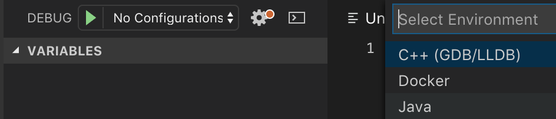

Python源码学习笔记
=================

> 刘欣 2018.10.30


最近在学习Python源码，参考《Python源码剖析》这本书，主要内容有：

1. 对象系统
    - PyObject、int、str、list、dict
1. 虚拟机
    - interpreter->thread->frame->code->namespace->closure...
1. 其他
    - 垃圾回收、GIL、import


### Index

- [PyObject对象系统](./object.md)
- [GC垃圾回收机制](./gc.md)


### Python总体架构


### Python源码结构

- Include  	Python提供的所有头文件（著名的Python.h)
- Lib		Python自带的标准库，python写的
- Modules    	标准库，c写的
- Parser		语法分析部分
- Objects 	所有的内建对象c实现
- Python		Compiler和Runtime引擎部分，运行核心所在
- Mac/PCBuild...  平台编译部分


### 学习环境
*   采用python2.7最新github代码
*   macbook 开发环境 gcc编译
*   vscode + lldb做debugger

### 编译python
参考源码/Mac/README，用gcc编译python
```
./configure
make
```
编译出来的是在主目录下的`./python.exe`，不用怀疑，是一个在mac下可以启动的二进制

```bash
➜  cpython git:(2.7) ✗ ./python.exe 
Python 2.7.15+ (heads/2.7:64ffee7, Oct 30 2018, 18:02:37) 
[GCC 4.2.1 Compatible Apple LLVM 10.0.0 (clang-1000.11.45.2)] on darwin
Type "help", "copyright", "credits" or "license" for more information.
>>> 
```

通过第一行输出的``Oct 30 2018, 18:02:37``看出来，就是我们刚刚编译好的python了

### vscode调试

有两种方式通过lldb来调试python: attatch和launch

#### 准备工作
1. vscode安装cpp插件：[vscode-cpptools](https://github.com/Microsoft/vscode-cpptools)
2. 在vscode里打开python源码，新建Debug配置，可能需要新建.vscode目录保存配置文件。如图：



#### lldb attach 配置
运行编译的python.exe，launch.json配置文件如下，proceeId修改为python.exe的pid：
```json
        {
            "type": "cppdbg",
            "name": "(lldb) attach",
            "program": "${workspaceFolder}/python.exe",
            "request": "attach",
            "processId": "3917",
            "MIMode": "lldb"
        },
```

#### lldb launch 配置
选择launch方式启动，vscode会启动terminal运行python.exe
```json
    "configurations": [
        {
            "name": "(lldb) Launch",
            "type": "cppdbg",
            "request": "launch",
            "program": "${workspaceFolder}/python.exe",
            "args": [],
            "stopAtEntry": false,
            "cwd": "${workspaceFolder}",
            "environment": [],
            "externalConsole": true,
            "MIMode": "lldb"
        }
    ]
```

然后可以通过断点的方式很方便地查看调用栈，配合《源码剖析》看非常有帮助。

如下图，可以看出一个简单的 1+2 c栈真tm深啊


